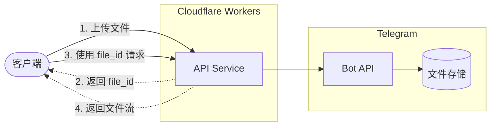

# AWSL Telegram Storage

基于 Cloudflare Workers 的 Telegram 文件存储 API 服务。利用 Telegram Bot API 实现文件的上传和下载功能，可作为轻量级的文件托管解决方案。

## 功能特性

- **单文件上传** - 支持通过文件或 URL 上传图片/文档到 Telegram
- **媒体组上传** - 批量上传多张图片（1-10张）组成媒体组
- **文件下载** - 通过 file_id 从 Telegram 下载文件
- **视频流播放** - 多分片视频串联，支持 HTTP Range 请求和进度条拖动
- **压缩优化** - 长视频支持 deflate 压缩 URL 参数
- **OpenAPI 文档** - 自动生成的 API 文档，支持在线调试
- **CORS 支持** - 跨域请求支持
- **API 鉴权** - 基于 Token 的接口访问控制

## 架构图



## 技术栈

- [Cloudflare Workers](https://workers.cloudflare.com/) - Serverless 运行时
- [Hono](https://hono.dev/) - 轻量级 Web 框架
- [Chanfana](https://github.com/cloudflare/chanfana) - OpenAPI 规范生成
- [Zod](https://zod.dev/) - TypeScript 优先的数据验证
- TypeScript

## 快速开始

### 前置条件

1. [Node.js](https://nodejs.org/) >= 18
2. [Cloudflare 账号](https://dash.cloudflare.com/)
3. Telegram Bot Token（通过 [@BotFather](https://t.me/BotFather) 创建）
4. Telegram Chat ID（用于存储文件的频道/群组/私聊 ID）

### 安装

```bash
# 克隆项目
git clone https://github.com/your-username/awsl-telegram-storage.git
cd awsl-telegram-storage

# 安装依赖
pnpm install
```

### 配置

1. 复制配置模板：

```bash
cp wrangler.jsonc.template wrangler.jsonc
```

2. 编辑 `wrangler.jsonc`，修改 `routes` 中的自定义域名（可选）

3. 配置环境变量：

**本地开发**：创建 `.dev.vars` 文件：

```env
BOT_TOKEN=your_telegram_bot_token
CHAT_ID=your_telegram_chat_id
API_TOKEN=your_api_access_token
```

**生产部署**：使用 Wrangler CLI 设置密钥：

```bash
pnpm wrangler secret put BOT_TOKEN
pnpm wrangler secret put CHAT_ID
pnpm wrangler secret put API_TOKEN
```

### 环境变量说明

| 变量名 | 说明 | 示例 |
|--------|------|------|
| `BOT_TOKEN` | Telegram Bot Token | `123456:ABC-DEF1234ghIkl-zyx57W2v1u123ew11` |
| `CHAT_ID` | 存储文件的 Chat ID | `-1001234567890` 或 `@channel_name` |
| `API_TOKEN` | API 访问令牌（自定义） | `my-secure-token-123` |

### 运行

```bash
# 本地开发
pnpm run dev

# 部署到 Cloudflare Workers
pnpm run deploy

# 构建（不部署）
pnpm run build
```

## API 文档

部署后访问 `/docs` 查看交互式 API 文档。

### 端点列表

| 方法 | 路径 | 说明 |
|------|------|------|
| `POST` | `/api/upload` | 上传单个文件 |
| `POST` | `/api/upload/group` | 上传媒体组 |
| `GET` | `/file/:file_id` | 下载文件 |
| `GET` | `/stream/video` | 视频流播放 |
| `GET` | `/docs` | API 文档 |
| `GET` | `/openapi.json` | OpenAPI 规范 |

### 上传单个文件

```bash
# 通过文件上传
curl -X POST https://your-domain.com/api/upload \
  -H "X-Api-Token: your_api_token" \
  -F "file=@/path/to/image.jpg" \
  -F "media_type=photo"

# 通过 URL 上传
curl -X POST https://your-domain.com/api/upload \
  -H "X-Api-Token: your_api_token" \
  -H "Content-Type: multipart/form-data" \
  -F "url=https://example.com/image.jpg" \
  -F "media_type=photo"
```

**请求参数**

| 参数 | 类型 | 必填 | 说明 |
|------|------|------|------|
| `file` | File | 否* | 要上传的文件 |
| `url` | string | 否* | 文件的 URL 地址 |
| `media_type` | string | 否 | 媒体类型：`photo`（默认）或 `document` |

\* `file` 和 `url` 必须提供其中之一

**响应示例**

```json
{
  "success": true,
  "files": [
    { "file_id": "AgACAgIAAxkB...", "width": 1920, "height": 1080 },
    { "file_id": "AgACAgIAAxkB...", "width": 320, "height": 180 }
  ]
}
```

> 注：图片上传会返回多个不同尺寸的文件，文档上传仅返回一个文件

### 上传媒体组

```bash
curl -X POST https://your-domain.com/api/upload/group \
  -H "X-Api-Token: your_api_token" \
  -H "Content-Type: application/json" \
  -d '{
    "urls": [
      "https://example.com/image1.jpg",
      "https://example.com/image2.jpg"
    ],
    "caption": "可选的图片说明"
  }'
```

**请求参数**

| 参数 | 类型 | 必填 | 说明 |
|------|------|------|------|
| `urls` | string[] | 是 | 图片 URL 数组（1-10 个） |
| `caption` | string | 否 | 媒体组说明（显示在第一张图片下方） |

**响应示例**

```json
{
  "success": true,
  "files": [
    [
      { "file_id": "AgACAgIAAxkB...", "width": 1920, "height": 1080 },
      { "file_id": "AgACAgIAAxkB...", "width": 320, "height": 180 }
    ],
    [
      { "file_id": "AgACAgIAAxkB...", "width": 1920, "height": 1080 },
      { "file_id": "AgACAgIAAxkB...", "width": 320, "height": 180 }
    ]
  ]
}
```

### 下载文件

```bash
# 直接下载（启用浏览器缓存，默认）
curl https://your-domain.com/file/AgACAgIAAxkB...

# 禁用浏览器缓存
curl https://your-domain.com/file/AgACAgIAAxkB...?cache=false

# 保存到本地
curl -o image.jpg https://your-domain.com/file/AgACAgIAAxkB...
```

**请求参数**

| 参数 | 类型 | 必填 | 默认值 | 说明 |
|------|------|------|--------|------|
| `cache` | string | 否 | `true` | 是否启用浏览器缓存（`true`/`false`） |

**响应头**

| 响应头 | 说明 | 可能值 |
|--------|------|--------|
| `X-Cache-Status` | 缓存状态 | `ENABLED` - 浏览器缓存已启用<br>`DISABLED` - 浏览器缓存已禁用 |
| `Cache-Control` | 浏览器缓存控制 | 启用时：`public, max-age=604800, immutable`（7天）<br>禁用时：`no-store, no-cache, must-revalidate` |

> 下载端点无需 API Token 鉴权

### 视频流播放

将多个 Telegram 文件分片串联为一个连续的视频流，支持浏览器 video 标签原生播放和进度条拖动。

```html
<!-- 明文格式（短视频） -->
<video controls src="https://your-domain.com/stream/video?chunks=fileId1:10485760,fileId2:5242880"></video>

<!-- 压缩格式（长视频） -->
<video controls src="https://your-domain.com/stream/video?chunks=eJxLzs9Nz0nVSMnPz0nVBAA..."></video>
```

**URL 格式说明**

分片参数格式：`file_id:chunk_size`，多个分片用逗号分隔

```
/stream/video?chunks=AgACAgIAAxk:10485760,AgACAgIAAxl:10485760,AgACAgIAAxm:5242880
                     └─────┬─────┘ └────┬────┘  └─────┬─────┘ └────┬────┘
                        file_id      size(10MB)    file_id     size(5MB)
```

**压缩 URL（推荐用于 >5 个分片）**

使用 deflate + base64url 编码可将 URL 压缩 60-75%：

```javascript
// 前端压缩函数
async function compressChunks(chunks) {
  const data = chunks.map(c => `${c.file_id}:${c.size}`).join(',')
  const stream = new Blob([data]).stream()
    .pipeThrough(new CompressionStream('deflate-raw'))
  const compressed = await new Response(stream).arrayBuffer()
  const base64 = btoa(String.fromCharCode(...new Uint8Array(compressed)))
  return base64.replace(/\+/g, '-').replace(/\//g, '_').replace(/=+$/g, '')
}

// 使用示例
const chunks = [
  { file_id: 'AgACAgIAAxk...', size: 10485760 },
  { file_id: 'AgACAgIAAxl...', size: 10485760 },
  { file_id: 'AgACAgIAAxm...', size: 5242880 }
]

const compressed = await compressChunks(chunks)
const videoUrl = `/stream/video?chunks=${compressed}`
```

**请求参数**

| 参数 | 类型 | 必填 | 说明 |
|------|------|------|------|
| `chunks` | string | 是 | 明文格式（`file_id:size,...`）或压缩格式（base64url） |

**响应特性**

- ✅ 支持 HTTP Range 请求（206 Partial Content）
- ✅ 浏览器 video 标签原生支持
- ✅ 进度条拖动（seek）
- ✅ 完整分片流式传输，仅首尾分片加载到内存
- ✅ 自动检测格式（明文/压缩）

**URL 长度限制**

| 视频大小 | 分片数 | 明文长度 | 压缩后 | 状态 |
|---------|-------|---------|--------|------|
| 100MB | 10 | ~1000字符 | ~400字符 | ✅ |
| 500MB | 50 | ~5000字符 | ~1500字符 | ✅ |
| 1GB | 100 | ~10000字符 | ~2500字符 | ✅ (推荐压缩) |
| 2GB+ | 200+ | 超长 | ~5000字符 | ⚠️ 建议服务端存储映射 |

> 视频流端点无需 API Token 鉴权

## 项目结构

```
awsl-telegram-storage/
├── src/
│   ├── index.ts            # 应用入口，路由配置
│   ├── api_upload.ts       # 单文件上传端点
│   ├── api_upload_group.ts # 媒体组上传端点
│   ├── api_download.ts     # 文件下载端点
│   ├── api_stream.ts       # 视频流播放端点
│   └── telegram.ts         # Telegram API 工具函数
├── wrangler.jsonc.template # Wrangler 配置模板
├── tsconfig.json           # TypeScript 配置
└── package.json            # 项目依赖
```

## 限制说明

- Telegram Bot API 对文件大小有限制，详见 [官方文档](https://core.telegram.org/bots/api#sending-files)
- 媒体组最多包含 10 个媒体
- `photo` 类型会压缩图片，如需保持原图请使用 `document` 类型
- 通过 URL 上传时，Telegram 服务器需要能访问该 URL
- 视频流 URL 参数长度建议不超过 8KB，超长视频建议使用压缩格式
- 每个视频分片建议 10MB，Cloudflare Workers 单次请求内存限制 128MB

## 获取 Telegram Chat ID

Chat ID 支持两种格式：
- **数字 ID**：如 `-1001234567890`
- **@username**：公开频道/群组可直接使用 `@channel_name` 格式

### 获取数字 ID 的方法

1. **私聊 Bot**：向 Bot 发送消息后，访问 `https://api.telegram.org/bot<BOT_TOKEN>/getUpdates` 查看 `chat.id`

2. **频道**：将 Bot 添加为频道管理员，向频道发送消息，然后通过 `getUpdates` API 获取 `chat.id`（通常为负数，如 `-1001234567890`）

3. **群组**：将 Bot 添加到群组，在群组中 @Bot 或发送消息，然后通过 `getUpdates` API 获取

> 提示：公开频道可直接使用 `@username` 作为 CHAT_ID，无需获取数字 ID

## 许可证

MIT License

## 贡献

欢迎提交 Issue 和 Pull Request！
